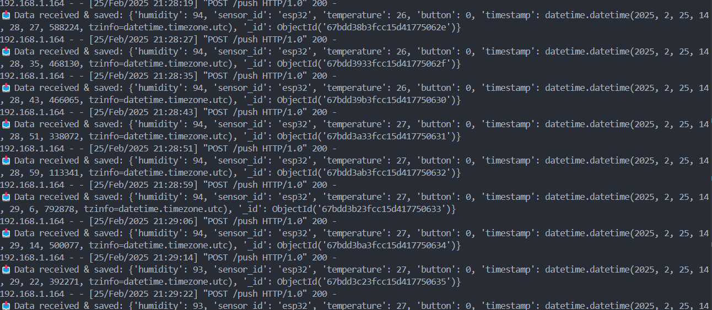

# Tugas Assignment 2 SIC - Team Bottlebound UNI331
Sensor yang kami gunakan adalah DHT11 dan push button

## API
Untuk API nya kami gunakan flask yang dijalankan dengan mengexecute file ``server.py``
```
python server.py
```
Sebelumnya install dulu packagenya
```
pip install -r requirements.txt
```

Berikut ini hasil nya : 

**Mongodb**


**Flask server**


## Kode ESP32
Kode untuk esp32 ada di file ``esp32.py``